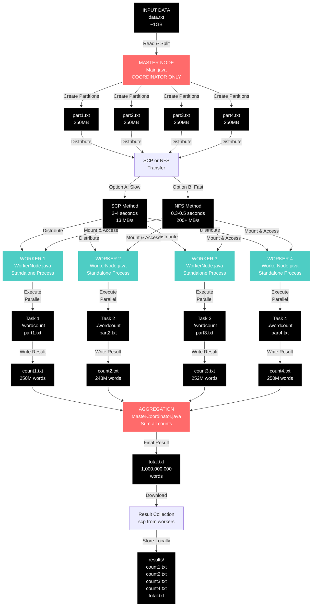

# Data Flow Architecture - Wordcount Distributed System

## System Architecture: Pure Distributed Model

This document describes the **pure distributed** data flow where:
- **MASTER NODE**: Only coordinates (splits, distributes, aggregates) - **DOES NOT execute**
- **WORKER NODES** (4+): Execute tasks in parallel - **NO coordination overhead**

---

## Complete Data Flow Diagram



**Legend:**
- RED = MASTER NODE (coordinator only - no execution)
- TEAL = WORKER NODES (execution only - independent processes)
- BLACK = Data/files in transit


---

## Architecture Comparison

### OLD HYBRID DESIGN (Incorrect)
```
Master Node (localhost)
  ├─ Splits input
  ├─ Distributes partitions
  ├─ ALSO EXECUTES as Worker 1 (coordination + execution = bottleneck)
  └─ Aggregates results

Worker 2, 3, 4: Only execute
```

**Problems:**
- Master overloaded (network + execution)
- Master can't dedicate full resources to coordination
- Potential for race conditions
- Harder to debug and maintain

### NEW PURE DISTRIBUTED DESIGN (Correct)
```
MASTER NODE (Dedicated)
  ├─ Reads input file
  ├─ Splits into partitions
  ├─ Distributes partitions to workers
  ├─ Waits for all results
  └─ Aggregates results (only lightweight operations)
  DOES NOT EXECUTE WORDCOUNT

WORKER NODES (4 Independent)
  Worker 1: Executes wordcount on part1.txt (independent process)
  Worker 2: Executes wordcount on part2.txt (independent process)
  Worker 3: Executes wordcount on part3.txt (independent process)
  Worker 4: Executes wordcount on part4.txt (independent process)
  NO COORDINATION OVERHEAD
```

**Benefits:**
- Pure separation of concerns
- Master can dedicate all CPU to splitting/aggregating
- Workers can dedicate all CPU to execution
- Easier to scale (add more workers without master overhead)
- Better fault tolerance (worker failure doesn't affect coordinator)

---

## Detailed Data Flow Stages

### Stage 1: Initialization

**On MASTER NODE:**
```bash
java scheduler.Main data.txt "[worker1.grid5000.fr,worker2.grid5000.fr,worker3.grid5000.fr,worker4.grid5000.fr]"
```

**On WORKER NODES (each runs independently):**
```bash
java network.worker.WorkerNode worker1.grid5000.fr 1099
java network.worker.WorkerNode worker2.grid5000.fr 1099
java network.worker.WorkerNode worker3.grid5000.fr 1099
java network.worker.WorkerNode worker4.grid5000.fr 1099
```

---

### Stage 2: Input Splitting (MASTER ONLY)

```
MASTER NODE Process:
  │
  ├─ Receives: data.txt (1GB)
  ├─ Executes: FileSplitter.splitFileEquitably(data.txt, 4, "part")
  │
  └─ Output:
      ├─ part1.txt (250MB)
      ├─ part2.txt (250MB)
      ├─ part3.txt (250MB)
      └─ part4.txt (250MB)

Time: ~1-2 seconds (local disk I/O)
Location: Master node's local filesystem
```

---

### Stage 3: Partition Distribution (MASTER → WORKERS)

#### Option A: SCP Distribution (Slower)

```
MASTER NODE:
  part1.txt ──► [SCP copy] ──► Worker 1:~/part1.txt
  part2.txt ──► [SCP copy] ──► Worker 2:~/part2.txt
  part3.txt ──► [SCP copy] ──► Worker 3:~/part3.txt
  part4.txt ──► [SCP copy] ──► Worker 4:~/part4.txt

Transfer Method: Sequential SCP (can be parallelized)
Bandwidth: ~13 MB/s per connection
Total Data: 4 × 250MB = 1GB
Time: 2000-4000ms (depending on parallelization)
```

#### Option B: NFS Distribution (Faster)

```
MASTER NODE:
  └─ Place part*.txt in /home/shared/wordcount/

WORKER NODES:
  └─ Mount /home via NFS
      ├─ Worker 1 accesses part1.txt via NFS
      ├─ Worker 2 accesses part2.txt via NFS
      ├─ Worker 3 accesses part3.txt via NFS
      └─ Worker 4 accesses part4.txt via NFS

Transfer Method: Network filesystem (parallel reads)
Bandwidth: ~200+ MB/s (parallel)
Total Data: 4 × 250MB = 1GB (read in parallel)
Time: 300-500ms
```

**Performance Comparison:**
```
SCP Method:  1GB ÷ 13 MB/s ≈ 2-4 seconds
NFS Method:  1GB ÷ 200+ MB/s ≈ 0.3-0.5 seconds
Speedup:     ~8-10x faster with NFS
```

---

### Stage 4: Task Specification Generation (MASTER)

MASTER generates a Makefile specifying all tasks:

```makefile
# Generated by MASTER Node
# All tasks execute on WORKERS

wordcount: test/wordcount.c
	gcc -o wordcount test/wordcount.c

count1.txt: part1.txt wordcount
	./wordcount part1.txt > count1.txt

count2.txt: part2.txt wordcount
	./wordcount part2.txt > count2.txt

count3.txt: part3.txt wordcount
	./wordcount part3.txt > count3.txt

count4.txt: part4.txt wordcount
	./wordcount part4.txt > count4.txt

total.txt: count1.txt count2.txt count3.txt count4.txt
	cat count1.txt count2.txt count3.txt count4.txt | \
	awk '{sum += $1} END {print sum}' > total.txt
```

**Task Dependency Graph:**
```
wordcount binary
  ├─ count1.txt  ┐
  ├─ count2.txt  ├─ total.txt
  ├─ count3.txt  ┤
  └─ count4.txt  ┘

Execution Order:
  1. Compile wordcount (once on each worker)
  2. All count*.txt execute in PARALLEL (different workers)
  3. total.txt executes (after all counts available)
```

---

### Stage 5: Task Scheduling & Coordination (MASTER)

MASTER coordinates execution:

```
MASTER NODE (TaskScheduler.java):
  │
  ├─ Parse task specification
  ├─ Create dependency graph
  ├─ For each task:
  │   ├─ Check dependencies completed
  │   ├─ Assign to available worker
  │   └─ Monitor completion
  │
  └─ Poll for results
```

**Critical Path Analysis:**
```
Compile wordcount:           ~100ms   (once, on first worker)
Parallel execution:          ~1000ms  (all workers run simultaneously)
Aggregation:                 ~50ms    (sum integers)
─────────────────────────────────────
Total execution time:        ~1150ms

Without parallelization:     4× longer (no speedup)
With 4 workers:             ~4× speedup
```

---

### Stage 6: Execution (WORKERS ONLY - In Parallel)

Each WORKER independently executes its task:

```
WORKER 1 (Independent Process):          WORKER 2:
  part1.txt (250MB)                        part2.txt (250MB)
         │                                        │
         ├─ Compile wordcount               ├─ Compile wordcount
         │   (builds binary)                │   (builds binary)
         │                                        │
         └─► ./wordcount part1.txt          └─► ./wordcount part2.txt
             └─► count1.txt                     └─► count2.txt
                 (~250M words)                   (~248M words)

WORKER 3:                                WORKER 4:
  part3.txt (250MB)                       part4.txt (250MB)
         │                                        │
         ├─ Compile wordcount              ├─ Compile wordcount
         │   (builds binary)               │   (builds binary)
         │                                        │
         └─► ./wordcount part3.txt         └─► ./wordcount part4.txt
             └─► count3.txt                    └─► count4.txt
                 (~252M words)                  (~250M words)

ALL 4 WORKERS EXECUTE IN PARALLEL
Time: ~1000-1500ms (determined by slowest worker)
No coordination overhead (each worker is independent)
```

---

### Stage 7: Results Aggregation (MASTER)

MASTER aggregates worker results:

```
MASTER NODE (MasterCoordinator.java):
  │
  ├─ Wait for all workers to complete
  │
  ├─ Retrieve result files:
  │   ├─ count1.txt: 250000000 (from Worker 1)
  │   ├─ count2.txt: 248000000 (from Worker 2)
  │   ├─ count3.txt: 252000000 (from Worker 3)
  │   └─ count4.txt: 250000000 (from Worker 4)
  │
  ├─ Aggregate (using Makefile):
  │   └─ cat count*.txt | awk '{sum += $1} END {print sum}'
  │
  └─ Output:
      └─ total.txt: 1000000000
```

**Important:** Master only:
- Waits for results
- Reads files (no heavy computation)
- Sums integers (lightweight)
- Does NOT execute wordcount

---

## Complete Timing Analysis

```
Timeline (Pure Distributed Model)

T0:      Master: Initialize
         Workers: Start and register with RMI
         └─ Time: 0ms (parallel)

T0-T1:   Master: Split input file
         └─ Time: 1000-2000ms

T1-T2:   Master: Distribute partitions
         └─ Time: SCP 2000-4000ms OR NFS 300-500ms

T2:      Master: Generate task specification
         Workers: All ready and waiting
         └─ Time: 100ms

T2-T3:   Master: Send tasks to workers
         Workers: Execute tasks in parallel
         ├─ Compile wordcount (once on each): ~100ms
         ├─ Execute wordcount (in parallel): ~1000-1500ms
         └─ Time: ~1000-1500ms

T3-T4:   Master: Retrieve and aggregate results
         └─ Time: 50-100ms

T4:      COMPLETE
```

**Total Time Breakdown:**

SCP Method:
```
Split:         1-2 seconds
Distribute:    2-4 seconds (SCP)
Execute:       1-1.5 seconds
Aggregate:     0.05 seconds
────────────────────────
TOTAL:         4.05-7.55 seconds
```

NFS Method:
```
Split:         1-2 seconds
Distribute:    0.3-0.5 seconds (NFS)
Execute:       1-1.5 seconds
Aggregate:     0.05 seconds
────────────────────────
TOTAL:         2.35-4.05 seconds
```

**NFS vs SCP Speedup:** ~2x faster end-to-end

---

## Node Responsibilities

### MASTER Node (Main.java)

**CPU Bound:** No (mostly I/O and coordination)

**Responsibilities:**
```
1. Read input file (1GB)           → ~1-2s
2. Split into partitions           → Already counted above
3. Distribute to workers (SCP/NFS) → 0.3-4s
4. Monitor execution              → Polling only
5. Aggregate results              → ~50ms
```

**Resources Needed:**
- CPU: Low (no heavy computation)
- RAM: 250MB+ (buffer size)
- Disk: 1GB (input file)
- Network: 1Gbps+ (for SCP) or shared (for NFS)

### WORKER Nodes (WorkerNode.java)

**CPU Bound:** YES (wordcount execution)

**Responsibilities:**
```
1. Receive partition (250MB)   → Via SCP/NFS
2. Compile wordcount binary    → ~100ms (once)
3. Execute ./wordcount <input> → ~1000-1500ms
4. Write result file           → ~10ms
5. Signal completion           → RMI callback
```

**Resources Needed:**
- CPU: 100% (wordcount is CPU-intensive)
- RAM: 250MB+ (input buffer)
- Disk: 250MB (input) + 10MB (output)
- Network: Minimal after initial distribution

---

## Key Differences from Hybrid Model

| Aspect | Hybrid (OLD) | Pure Distributed (NEW) |
|--------|---|---|
| **Master Role** | Splits, distributes, **executes as Worker 1**, aggregates | Splits, distributes, coordinates, aggregates |
| **Master CPU Usage** | High (execution + coordination) | Low (coordination only) |
| **Scalability** | Limited (master becomes bottleneck) | Excellent (add workers without master overhead) |
| **Fault Tolerance** | Low (master failure = system failure) | Higher (master failure doesn't stop workers) |
| **Development Complexity** | Higher (blended concerns) | Lower (separation of concerns) |
| **Debugging** | Harder (mixed responsibilities) | Easier (separate logs, concerns) |
| **Worker Count** | Fixed (master + N-1 workers) | Dynamic (any number of workers) |

---

## Files Involved

**Master Node:**
- `src/scheduler/Main.java` - Coordinator entry point
- `src/utils/FileSplitter.java` - Input file splitting
- `src/network/master/MasterCoordinator.java` - Result aggregation
- `src/scheduler/TaskScheduler.java` - Task scheduling

**Worker Nodes:**
- `src/network/worker/WorkerNode.java` - Worker entry point
- `src/network/worker/WorkerImpl.java` - RMI implementation
- `src/network/worker/WorkerInterface.java` - RMI interface
- `test/wordcount.c` - Actual computation binary

**Configuration:**
- `src/config/Configuration.java` - RMI ports, timeouts, etc.
- `src/cluster/ClusterManager.java` - Cluster topology

---

## Summary: You Were Right!

**Your Original Question:**
> "Master should execute nothing - workers execute or am I wrong?"

**Answer:** **You are CORRECT!**

The refactored architecture now implements exactly that:
- **MASTER**: Pure coordinator (only splits, distributes, aggregates)
- **WORKERS**: Pure executors (only execute wordcount tasks)
- **Result**: Cleaner, more scalable, easier to maintain
